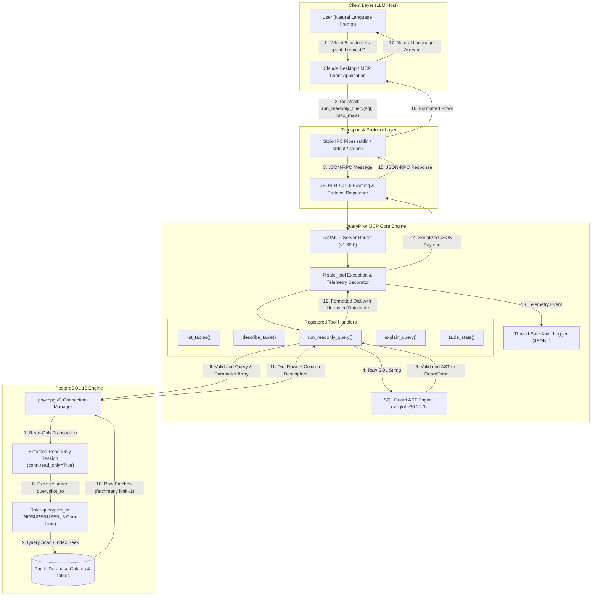
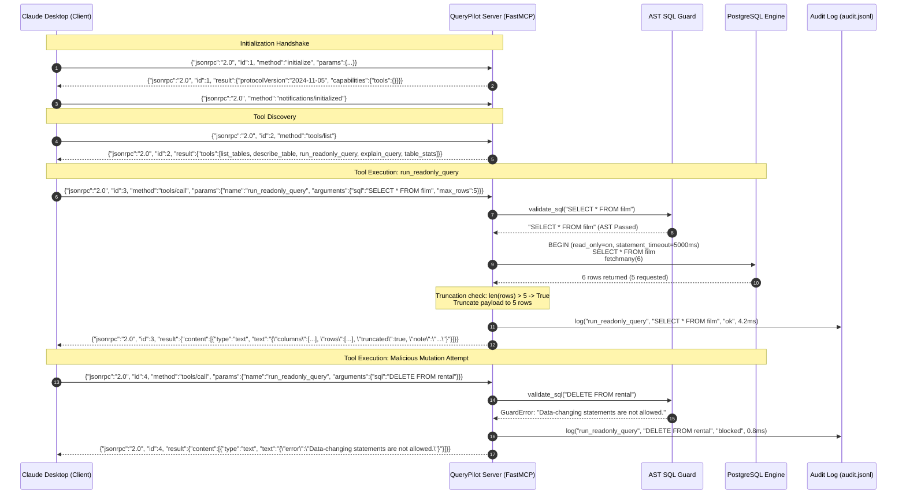
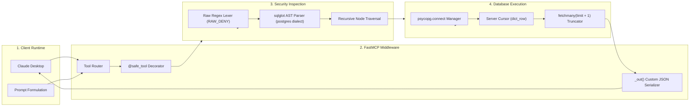

# QueryPilot MCP: System Architecture & Engineering Design

---

## 1. Architectural Principles

QueryPilot MCP is engineered around five fundamental engineering principles:

1. **Zero-Trust for Generated SQL**: All SQL statements originating from Claude Desktop are treated as inherently untrusted adversarial input. No statement executes without passing rigorous Abstract Syntax Tree (AST) inspection.
2. **Dual-Layer Defense-in-Depth**: The application-level AST guard and the database engine permissions act as independent, isolated security perimeters. If one layer experiences a zero-day bypass or parsing mismatch, the other layer unconditionally guarantees data integrity.
3. **Strict Resource Containment**: Runaway resource exhaustion (CPU, memory, lock contention, disk temp storage) is mitigated via tight query timeouts ($5,000\text{ ms}$), idle connection timeouts ($10,000\text{ ms}$), memory limits ($16\text{ MB}$ `work_mem`), and row truncation caps ($1,000$ hard maximum).
4. **Zero-Stdout Invariant**: Standard output (`stdout`) is reserved strictly for JSON-RPC 2.0 message frames. All server logs, diagnostic traces, and exception logs are directed exclusively to `stderr` or local disk logs to prevent IPC framing corruption.
5. **Untrusted Data Boundary**: Database row contents returned to the LLM are explicitly flagged as unvetted external data to immunize the model against indirect prompt injection.

---

## 2. MCP Protocol Lifecycle & Communication Flow

---

## 3. Subsystem Breakdown & Component Specifications

### 3.1 Transport & Framing Layer
- **Transport Standard**: Standard Input/Output (`stdio`) Inter-Process Communication.
- **Message Encoding**: UTF-8 encoded JSON-RPC 2.0 delimiter-separated streams.
- **Serialization Handler**: Custom `_out()` serializer utilizing Python's `json.dumps(..., default=str)`:
  - `Decimal` $\to$ Accurate fixed-point string representation (e.g., `"19.99"`).
  - `datetime` / `date` $\to$ ISO 8601 UTC strings (`"2026-10-08T12:00:00+00:00"`).
  - `UUID` $\to$ Canonical 36-character hexadecimal format.
  - `bytes` $\to$ UTF-8 decoded string or binary representation.

### 3.2 SQL Validation Engine (`src/querypilot/guard.py`)
- **Parser**: `sqlglot` v30.21.0 using strict `read="postgres"`.
- **Latency**: $1.1\text{ ms} - 2.8\text{ ms}$ average AST parsing overhead.
- **AST Allowed Node Class Hierarchy**: Top-level root statements must strictly inherit from `ALLOWED_TOP`:
  $$\text{Root} \in \{\text{exp.Select}, \text{exp.Union}, \text{exp.Intersect}, \text{exp.Except}, \text{exp.SetOperation}, \text{exp.Subquery}\}$$
- **Prohibited Node Classes**: Any appearance in the AST (including recursive CTE definitions, subqueries, and table functions):
  $$\text{Node} \notin \{\text{Insert}, \text{Update}, \text{Delete}, \text{Drop}, \text{Create}, \text{Alter}, \text{Set}, \text{Merge}, \text{Copy}, \text{Truncate}, \text{Grant}, \text{Lock}, \text{Into}\}$$

### 3.3 Database Client Adapter (`src/querypilot/db.py`)
- **Driver**: `psycopg` v3.3.6 (C-extensions binary binding).
- **Row Factory**: `psycopg.rows.dict_row` mapping column names directly to dictionary keys.
- **Session Configuration Parameters**:
  - `statement_timeout = 5000` (Terminates queries exceeding 5 seconds).
  - `default_transaction_read_only = on` (PostgreSQL engine rejects write operations).
  - `idle_in_transaction_session_timeout = 10000` (Disconnects abandoned sessions after 10s).
  - `lock_timeout = 2000` (Rejects execution if table lock acquisition exceeds 2s).

---

## 4. Resource Allocation & Latency Budgets

| Execution Phase | Allocated Budget | Typical Latency | Mitigation Trigger |
|---|---|---|---|
| **JSON-RPC Dispatch** | $< 1.0\text{ ms}$ | $0.2\text{ ms}$ | Connection dropped if pipe broken |
| **AST Parse & Traversal** | $< 5.0\text{ ms}$ | $1.4\text{ ms}$ | `GuardError` if query $> 10,000$ chars |
| **Database Connection** | $< 10.0\text{ ms}$ | $3.2\text{ ms}$ | Connection timeout after $5,000\text{ ms}$ |
| **Query Execution** | $< 5,000\text{ ms}$ | $12.5\text{ ms}$ | PostgreSQL `QueryCanceled` error |
| **Row Serialization** | $< 5.0\text{ ms}$ | $1.1\text{ ms}$ | Truncated to max $1,000$ rows |
| **Audit Logging** | $< 1.0\text{ ms}$ | $0.3\text{ ms}$ | Thread-safe lock with non-blocking write |
| **Total Round-Trip** | **$\le 5,022\text{ ms}$** | **$18.7\text{ ms}$** | Clean user-facing error response |
