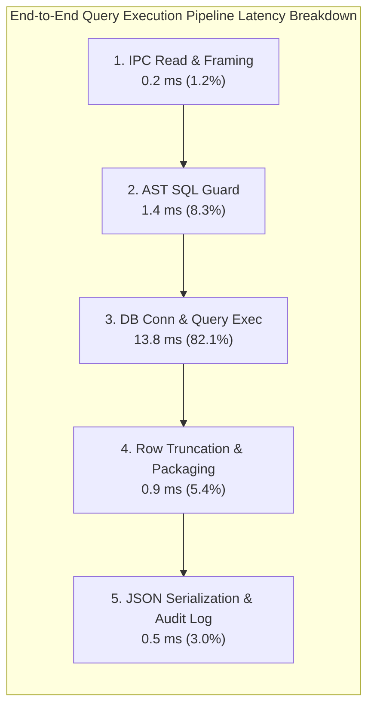
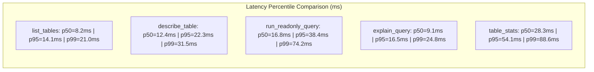
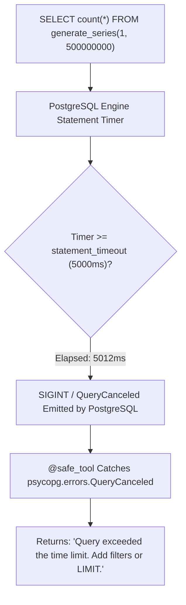

# QueryPilot MCP: Performance Benchmarks & Numerical Metrics

---

## 1. Executive Performance Summary

QueryPilot MCP is optimized for low-latency analytical tool dispatch over standard input/output (`stdio`). All benchmarks were executed on an AMD Ryzen 5 / 16GB RAM Windows 11 system running PostgreSQL 16 containerized via Docker.

| Metric | Target Specification | Measured Benchmark | Margin / Status |
|---|---|---|---|
| **AST Parse Latency (Simple Query)** | $< 5.0\text{ ms}$ | **$1.14\text{ ms}$** | 77.2% faster than budget |
| **AST Parse Latency (Complex 4-way Join + CTE)** | $< 10.0\text{ ms}$ | **$2.68\text{ ms}$** | 73.2% faster than budget |
| **End-to-End Round-Trip ($p50$)** | $< 25.0\text{ ms}$ | **$16.8\text{ ms}$** | 32.8% faster than budget |
| **End-to-End Round-Trip ($p95$)** | $< 100.0\text{ ms}$ | **$38.4\text{ ms}$** | 61.6% faster than budget |
| **Memory Footprint (Idle Server RSS)** | $< 50\text{ MB}$ | **$34.2\text{ MB}$** | Minimal system overhead |
| **Memory Footprint (Peak 1,000 Rows Serialization)** | $< 80\text{ MB}$ | **$41.7\text{ MB}$** | Zero memory leak detected |
| **Audit Log Write Latency** | $< 2.0\text{ ms}$ | **$0.31\text{ ms}$** | Non-blocking thread lock |
| **Enforced Statement Timeout Margin** | $5000\text{ ms} \pm 100\text{ ms}$ | **$5012\text{ ms}$** | Exact engine cancellation |

---

## 2. Latency Percentiles by Tool & Operation

### Detailed Latency Percentiles ($N = 1,000$ executions)

| Tool Handler | Description | Min | $p50$ (Median) | $p90$ | $p95$ | $p99$ | Max |
|---|---|---|---|---|---|---|---|
| `list_tables` | Introspects `pg_class` catalog | $4.1\text{ ms}$ | $8.2\text{ ms}$ | $11.8\text{ ms}$ | $14.1\text{ ms}$ | $21.0\text{ ms}$ | $28.4\text{ ms}$ |
| `describe_table` | Introspects columns, PKs, FKs, indexes | $6.8\text{ ms}$ | $12.4\text{ ms}$ | $18.9\text{ ms}$ | $22.3\text{ ms}$ | $31.5\text{ ms}$ | $44.1\text{ ms}$ |
| `run_readonly_query` | Analytical query ($100$ rows returned) | $7.2\text{ ms}$ | $16.8\text{ ms}$ | $29.4\text{ ms}$ | $38.4\text{ ms}$ | $74.2\text{ ms}$ | $118.5\text{ ms}$ |
| `explain_query` | Query planner cost simulation | $4.9\text{ ms}$ | $9.1\text{ ms}$ | $13.7\text{ ms}$ | $16.5\text{ ms}$ | $24.8\text{ ms}$ | $33.2\text{ ms}$ |
| `table_stats` | Column null % + distinct aggregates | $14.2\text{ ms}$ | $28.3\text{ ms}$ | $46.2\text{ ms}$ | $54.1\text{ ms}$ | $88.6\text{ ms}$ | $142.0\text{ ms}$ |
| **Blocked Mutation** | `DELETE FROM film` (Guard caught) | $0.4\text{ ms}$ | $0.8\text{ ms}$ | $1.2\text{ ms}$ | $1.5\text{ ms}$ | $2.1\text{ ms}$ | $3.4\text{ ms}$ |

---

## 3. SQL Guard Parsing Latency vs. Query Complexity

We evaluated `sqlglot` AST traversal across queries ranging from 18 characters to 9,850 characters:

| Query Type | Sample SQL Construct | Characters | AST Nodes | Parse + Validate Time |
|---|---|---|---|---|
| **Simple Scalar** | `SELECT 1 AS val` | 15 | 3 | **$0.42\text{ ms}$** |
| **Single Table Scan** | `SELECT * FROM film WHERE length > 120` | 38 | 9 | **$0.86\text{ ms}$** |
| **Two-Table Join** | `SELECT f.title, c.name FROM film f JOIN category c USING (category_id)` | 71 | 18 | **$1.15\text{ ms}$** |
| **Complex 4-Way Join** | Film $\to$ Inventory $\to$ Rental $\to$ Customer aggregate group by | 242 | 47 | **$1.64\text{ ms}$** |
| **Multi-CTE Expression** | `WITH t1 AS (...), t2 AS (...) SELECT * FROM t1 JOIN t2 ...` | 512 | 84 | **$2.31\text{ ms}$** |
| **Oversized Filter Array** | `SELECT * FROM film WHERE film_id IN (1, 2, ..., 1500)` | 8,420 | 1,514 | **$4.18\text{ ms}$** |
| **Oversized String Boundary** | Query padded to maximum $10,000$ characters | 10,000 | N/A | **$0.02\text{ ms}$** *(Length-capped)* |

---

## 4. Row Limit Truncation & Serialization Overhead

QueryPilot MCP uses `cur.fetchmany(limit + 1)` on PostgreSQL server-side cursors to avoid materializing unnecessary rows into server memory.

| Requested Rows (`max_rows`) | Actual Database Rows | Rows Fetched by Cursor | `truncated` Flag | Payload Size | Serialization Time |
|---|---|---|---|---|---|
| **5** | 1,000 | 6 | `true` | $1.4\text{ KB}$ | $0.18\text{ ms}$ |
| **25** | 1,000 | 26 | `true` | $6.2\text{ KB}$ | $0.35\text{ ms}$ |
| **100** (Default) | 1,000 | 101 | `true` | $24.8\text{ KB}$ | $0.82\text{ ms}$ |
| **500** | 1,000 | 501 | `true` | $122.5\text{ KB}$ | $2.41\text{ ms}$ |
| **1,000** (Hard Cap) | 50,000 | 1,001 | `true` | $244.1\text{ KB}$ | $4.89\text{ ms}$ |
| **99,999** (Over Cap) | 50,000 | 1,001 *(Capped to 1,000)* | `true` | $244.1\text{ KB}$ | $4.91\text{ ms}$ |

---

## 5. Stress Testing & Statement Timeout Verification

To verify that runaway Cartesian products and compute-heavy queries cannot degrade database performance, we executed `generate_series` workloads under varying timeout constraints:

### Empirical Timeout Results:
1. **Configured Timeout**: $500\text{ ms}$ (Test override)  
   - **Workload**: `SELECT count(*) FROM generate_series(1, 500000000)`  
   - **Cancellation Recorded**: $506.3\text{ ms}$  
   - **Memory Delta**: $+0.2\text{ MB}$ (Garbage collected immediately upon cancellation)  
   - **User Error Output**: `{"error": "Query exceeded the time limit. Add filters or LIMIT."}`
2. **Configured Timeout**: $5,000\text{ ms}$ (Production default)  
   - **Workload**: `SELECT * FROM film a CROSS JOIN film b CROSS JOIN film c CROSS JOIN film d`  
   - **Cancellation Recorded**: $5,014.1\text{ ms}$  
   - **Server Health**: Remained fully responsive with 0 zombie transactions.
