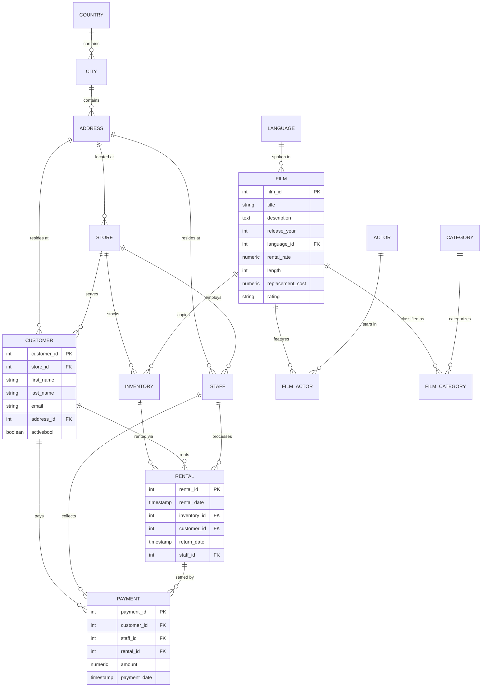
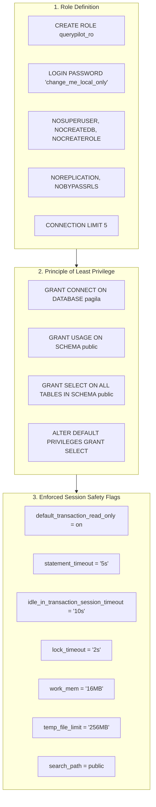

# QueryPilot MCP: Database Schema, Relational Models & Role Hardening



---

## 1. Relational Entities Specification

The included sample database is **Pagila** (the official PostgreSQL port of Sakila), representing a full-featured DVD rental enterprise schema.

### Core Tables Summary

| Table | Primary Key | Foreign Keys | Estimated Rows | Purpose |
|---|---|---|---|---|
| `film` | `film_id` | `language_id` $\to$ `language` | 1,000 | Film catalog metadata, rental pricing, length, rating. |
| `actor` | `actor_id` | None | 200 | Actor identities. |
| `film_actor` | `(actor_id, film_id)` | `actor_id`, `film_id` | 5,462 | Many-to-many junction between actors and films. |
| `category` | `category_id` | None | 16 | Genre classifications (Action, Comedy, Drama, Sci-Fi, etc.). |
| `film_category`| `(film_id, category_id)`| `film_id`, `category_id` | 1,000 | Many-to-many junction linking films to genres. |
| `customer` | `customer_id` | `store_id`, `address_id` | 599 | Registered customer profiles and email addresses. |
| `inventory` | `inventory_id` | `film_id`, `store_id` | 4,581 | Physical inventory copies across stores. |
| `rental` | `rental_id` | `inventory_id`, `customer_id`, `staff_id` | 16,044 | Transaction history of video rentals and returns. |
| `payment` | `payment_id` | `customer_id`, `staff_id`, `rental_id` | 16,049 | Payment records, billing amounts, and transaction dates. |
| `store` | `store_id` | `manager_staff_id`, `address_id` | 2 | Retail store locations and managers. |
| `staff` | `staff_id` | `address_id`, `store_id` | 2 | Store employees and administrators. |
| `address` | `address_id` | `city_id` | 603 | Street addresses, districts, postal codes, and phone numbers. |
| `city` | `city_id` | `country_id` | 600 | Cities and municipality entities. |
| `country` | `country_id` | None | 109 | Sovereign nations. |

---

## 2. Table Schema Details & Data Types

### `film`
```sql
CREATE TABLE film (
    film_id SERIAL PRIMARY KEY,
    title CHARACTER VARYING(255) NOT NULL,
    description TEXT,
    release_year INTEGER,
    language_id SMALLINT NOT NULL REFERENCES language(language_id),
    rental_duration SMALLINT DEFAULT 3 NOT NULL,
    rental_rate NUMERIC(4,2) DEFAULT 4.99 NOT NULL,
    length SMALLINT,
    replacement_cost NUMERIC(5,2) DEFAULT 19.99 NOT NULL,
    rating VARCHAR(10) DEFAULT 'G',
    last_update TIMESTAMP WITHOUT TIME ZONE DEFAULT now() NOT NULL,
    special_features TEXT[]
);
CREATE INDEX idx_film_title ON film(title);
```

### `customer`
```sql
CREATE TABLE customer (
    customer_id SERIAL PRIMARY KEY,
    store_id SMALLINT NOT NULL REFERENCES store(store_id),
    first_name CHARACTER VARYING(45) NOT NULL,
    last_name CHARACTER VARYING(45) NOT NULL,
    email CHARACTER VARYING(50),
    address_id SMALLINT NOT NULL REFERENCES address(address_id),
    activebool BOOLEAN DEFAULT true NOT NULL,
    create_date DATE DEFAULT ('now'::text)::date NOT NULL,
    last_update TIMESTAMP WITHOUT TIME ZONE DEFAULT now() NOT NULL,
    active INTEGER DEFAULT 1
);
CREATE INDEX idx_customer_last_name ON customer(last_name);
```

### `rental`
```sql
CREATE TABLE rental (
    rental_id SERIAL PRIMARY KEY,
    rental_date TIMESTAMP WITHOUT TIME ZONE NOT NULL,
    inventory_id INTEGER NOT NULL REFERENCES inventory(inventory_id),
    customer_id SMALLINT NOT NULL REFERENCES customer(customer_id),
    return_date TIMESTAMP WITHOUT TIME ZONE,
    staff_id SMALLINT NOT NULL REFERENCES staff(staff_id),
    last_update TIMESTAMP WITHOUT TIME ZONE DEFAULT now() NOT NULL
);
CREATE INDEX idx_rental_customer_id ON rental(customer_id);
```

### `payment`
```sql
CREATE TABLE payment (
    payment_id SERIAL PRIMARY KEY,
    customer_id SMALLINT NOT NULL REFERENCES customer(customer_id),
    staff_id SMALLINT NOT NULL REFERENCES staff(staff_id),
    rental_id INTEGER REFERENCES rental(rental_id) ON DELETE SET NULL,
    amount NUMERIC(5,2) NOT NULL,
    payment_date TIMESTAMP WITHOUT TIME ZONE NOT NULL
);
CREATE INDEX idx_payment_customer_id ON payment(customer_id);
```

---

## 3. Database Role Hardening (`db/init/01_roles.sql`)



### Explanations for Each Hardening Parameter:
- `NOSUPERUSER NOCREATEDB NOCREATEROLE`: Prevents role escalation, table creation, and user management.
- `NOBYPASSRLS`: Enforces row-level security policies if active.
- `CONNECTION LIMIT 5`: Thwarts connection flooding DoS from misbehaved client threads.
- `default_transaction_read_only = on`: Guarantees any `INSERT`, `UPDATE`, or `DELETE` triggers a PostgreSQL kernel fatal exception.
- `statement_timeout = '5s'`: Cancels queries executing longer than 5,000 milliseconds.
- `idle_in_transaction_session_timeout = '10s'`: Automatically drops transactions left open by client connections.
- `lock_timeout = '2s'`: Aborts queries waiting more than 2 seconds for a table lock.
- `work_mem = '16MB'`: Prevents queries from allocating gigabytes of RAM during hash aggregations and in-memory sorts.
- `temp_file_limit = '256MB'`: Prevents disk exhaustion from massive joins spilling to temporary disk space.
