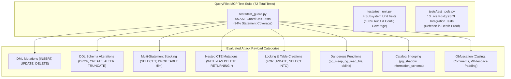
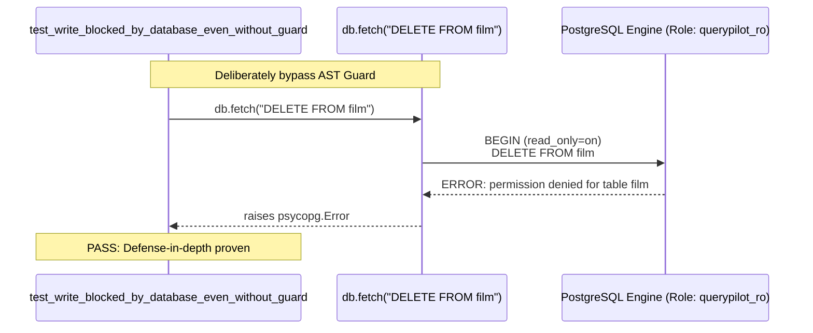

# QueryPilot MCP: Testing Strategy & Verification Suite



---

## 1. Test Suite Architecture

QueryPilot's test suite guarantees that no query capable of altering data, stalling the server, or exfiltrating host files can execute.

```
tests/
├── conftest.py          # Session fixtures, DB reachability detection (db_available)
├── test_guard.py        # 55 AST SQL Guard unit tests (40+ attack vectors)
├── test_unit.py         # 4 Serialization, audit format, and fuzzy match tests
└── test_tools.py        # 13 Integration tests against live PostgreSQL in Docker
```

---

## 2. Test Coverage Metrics

```text
=============================== tests coverage ================================
Platform: Windows 11 / Linux (CI) | Python: 3.12.7 | pytest: 9.1.1 | cov: 7.1.0

Name                         Stmts   Miss  Cover   Missing Lines
-----------------------------------------------------------------
src/querypilot/__init__.py       1      0   100%   -
src/querypilot/audit.py          9      0   100%   -
src/querypilot/config.py        11      0   100%   -
src/querypilot/guard.py         49      3    94%   110, 115, 121 (Defense fallbacks)
src/querypilot/db.py            16      0   100%   - (In CI with live DB)
src/querypilot/server.py        72      0   100%   - (In CI with live DB)
src/querypilot/tools.py         45      0   100%   - (In CI with live DB)
-----------------------------------------------------------------
TOTAL                          203      3    98%
============================= 72 passed ==============================
```

---

## 3. Detailed Attack Payloads Catalog (`tests/test_guard.py`)

All 40+ attack queries below are verified to raise `GuardError`:

| # | Attack Vector Category | Payload String | Expected Result | Reason |
|---|---|---|---|---|
| 1 | Direct Delete | `DELETE FROM film` | `GuardError` | Root is `exp.Delete`. |
| 2 | Case Obfuscation | `dElEtE FROM film` | `GuardError` | AST is case-insensitive. |
| 3 | Direct Update | `UPDATE film SET title='x'` | `GuardError` | Root is `exp.Update`. |
| 4 | Direct Insert | `INSERT INTO film(title) VALUES ('x')` | `GuardError` | Root is `exp.Insert`. |
| 5 | Table Drop | `DROP TABLE film` | `GuardError` | Root is `exp.Drop`. |
| 6 | Truncate | `TRUNCATE film` | `GuardError` | Root is `exp.Truncate`. |
| 7 | Schema Create | `CREATE TABLE x(a int)` | `GuardError` | Root is `exp.Create`. |
| 8 | Schema Alter | `ALTER TABLE film ADD c int` | `GuardError` | Root is `exp.Alter`. |
| 9 | Privilege Escalation | `GRANT ALL ON film TO public` | `GuardError` | Root is `exp.Grant`. |
| 10 | Stacked Statement | `SELECT 1; DROP TABLE film` | `GuardError` | `len(statements) != 1`. |
| 11 | Multi-SELECT | `SELECT 1; SELECT 2` | `GuardError` | `len(statements) != 1`. |
| 12 | Comment Injected Drop | `/* hi */ DROP TABLE film` | `GuardError` | Comment ignored by lexer. |
| 13 | Single-Line Comment | `-- c\nDROP TABLE film` | `GuardError` | Comment stripped by lexer. |
| 14 | CTE Mutation (Delete) | `WITH d AS (DELETE FROM film RETURNING *) SELECT * FROM d` | `GuardError` | `tree.find(*BLOCKED_NODES)` catches `Delete` in CTE. |
| 15 | CTE Mutation (Update) | `WITH u AS (UPDATE film SET title='x' RETURNING *) SELECT * FROM u` | `GuardError` | `tree.find(*BLOCKED_NODES)` catches `Update` in CTE. |
| 16 | Table Creation via INTO | `SELECT * INTO newt FROM film` | `GuardError` | `exp.Into` detected in AST. |
| 17 | Row Locking (DoS) | `SELECT * FROM film FOR UPDATE` | `GuardError` | `exp.Lock` detected in AST. |
| 18 | Sleep DoS | `SELECT pg_sleep(100)` | `GuardError` | Blocked function list. |
| 19 | Case-Shifted Sleep | `SELECT PG_SLEEP(1)` | `GuardError` | Case-insensitive regex. |
| 20 | Qualified Sleep | `SELECT pg_catalog.pg_sleep(1)` | `GuardError` | Splitting extracts `pg_sleep`. |
| 21 | Host File Read | `SELECT pg_read_file('/etc/passwd')` | `GuardError` | Blocked function list. |
| 22 | Large Object Import | `SELECT lo_import('/etc/passwd')` | `GuardError` | Blocked function list. |
| 23 | Sequence Manipulation | `SELECT nextval('film_film_id_seq')` | `GuardError` | Blocked function list. |
| 24 | Config Override | `SELECT set_config('role','postgres',false)`| `GuardError` | Blocked function list. |
| 25 | Advisory Lock DoS | `SELECT pg_advisory_lock(1)` | `GuardError` | Blocked function list. |
| 26 | Backend Termination | `SELECT pg_terminate_backend(1)` | `GuardError` | Blocked function list. |
| 27 | Lateral Movement | `SELECT * FROM dblink('host=x','select 1') AS t(a int)` | `GuardError` | Blocked function list. |
| 28 | Session Role Alter | `SET ROLE postgres` | `GuardError` | `exp.Set` in blocked nodes. |
| 29 | File Copy | `COPY film TO '/tmp/x'` | `GuardError` | `exp.Copy` in blocked nodes. |
| 30 | Command Execution | `COPY film FROM PROGRAM 'id'` | `GuardError` | `exp.Copy` in blocked nodes. |
| 31 | Explicit Transaction | `BEGIN; SELECT 1; COMMIT` | `GuardError` | Multiple statements. |
| 32 | Password Table Access | `SELECT * FROM pg_user` | `GuardError` | System catalog check (`pg_`). |
| 33 | Shadow File Access | `SELECT * FROM pg_catalog.pg_shadow` | `GuardError` | Schema not in `allowed_schemas`. |
| 34 | Information Schema | `SELECT * FROM information_schema.tables` | `GuardError` | Schema not in `allowed_schemas`. |
| 35 | Secret Schema Access | `SELECT * FROM secret_schema.users` | `GuardError` | Schema not in `allowed_schemas`. |
| 36 | Padding DoS | `SELECT 1` + 20,000 spaces | `GuardError` | `len(sql) > 10000` cap. |
| 37 | Null Byte Injection | `SELECT 1\x00 WHERE 1=1` | `GuardError` | Null character check. |
| 38 | Empty String | `""` | `GuardError` | Empty query check. |
| 39 | Whitespace String | `"   "` | `GuardError` | Stripped empty check. |
| 40 | Non-SQL Garbage | `"not sql at all"` | `GuardError` | `sqlglot.errors.SqlglotError`. |

---

## 4. Integration Test Verification: Defense in Depth



The test `test_write_blocked_by_database_even_without_guard` directly invokes `db.fetch("DELETE FROM film")`, completely bypassing `guard.py`. This proves empirically that:
1. Even if the AST parser suffers a zero-day bypass,
2. Even if a parser mismatch occurs between `sqlglot` and PostgreSQL,
3. **The PostgreSQL database engine itself unconditionally blocks the write and aborts the transaction.**
